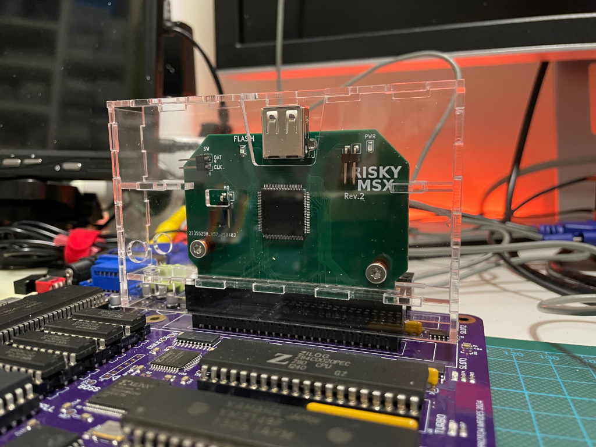

# Acrylic Enclosure for the RISKYMSX Cartridge for MSX Computers

## Introduction

The [RISKYMSX](https://github.com/arkadiuszmakarenko/RISKYMSX) by Arkadiusz Makarenko is a Flash ROM cartridge for [MSX computers](https://en.wikipedia.org/wiki/MSX).

This acrylic enclosure has been designed to be compatible with all existing revisions of the PCB, with rev2.1 and rev2 already validated.

The enclosure is based on the nice [acrylic enclosures by Capsule5000](https://github.com/capsule5000/CARTRIDGE_METHACRYLATE_MSX-EEPROM-Cartridge-64k).

## [Enclosure](enclosure/)

The enclosure is designed for 2mm acrylic sheet and must be cut by laser for optimal results.

## Building the enclosure

### Required material

* DINA5 (148x210mm) 2mm acrylic sheet
* UV Resin for bonding acrylic parts
* UV Curing lamp
* 2x 12mm M3 aluminium round standoffs
* 4x M3x6mm flat screws (or optionally, countersunk screws)
* (optional) 6.3mm (or similar) countersink drill bit for M3 screws

### Assembly instructions

TBC

* Use the provided [CAD design file](enclosure/riskymsx-enclosure-acrylic-2mm-dina5-ready-to-lasercut.dxf) to have the acrylic sheet cut by laser into the required parts.
* If you plan to use countersunk screws, you will need to use the 6.3mm countersink drill bit to prepare the screw holes for countersunk screws.
  The countersunk part of the holes must face the exterior side of the enclosure.
* The front, slot insert and left and right holder parts _must NOT_ be glued, they must remain free in order to be able to assemble and disassemble the enclosure for maintenance.
* The back, left, right and top parts must be joined together using UV Resin and the UV curing lamp.
  To ensure all parts fit together, assemble the whole cartridge with standoff and screws while bonding the required parts, but make sure you only use UV resin on the required bonding points without touching any of the parts that need to remain free.
* Use the UV curing lamp to strengthen the bonds, they will harden under ultraviolet light in a few seconds.

## References

Arkadiusz Makarenko RISKYMSX
* https://github.com/arkadiuszmakarenko/RISKYMSX

Capsule5000 acrylic enclosures
* https://github.com/capsule5000?tab=repositories

