# Acrylic Enclosure for the RISKYMSX Cartridge for MSX Computers

## Introduction

The [RISKYMSX](https://github.com/arkadiuszmakarenko/RISKYMSX) by Arkadiusz Makarenko is a Flash ROM cartridge for [MSX computers](https://en.wikipedia.org/wiki/MSX).

This acrylic enclosure has been designed to be compatible with all existing revisions of the PCB, with rev2.1 and rev2 already validated.

The enclosure is based on the nice [acrylic enclosures by Capsule5000](https://github.com/capsule5000/CARTRIDGE_METHACRYLATE_MSX-EEPROM-Cartridge-64k).

[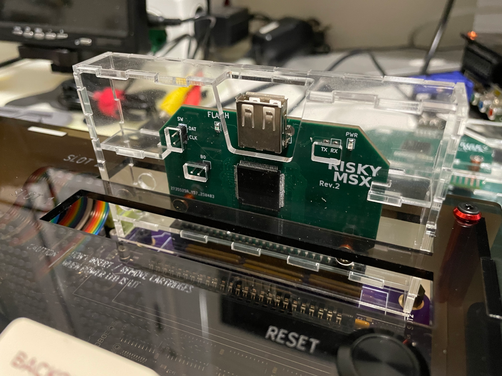](images/riskymsx-acrylic-enclosure-overview-IMG_7767.png)

## [Enclosure](enclosure/)

The enclosure is designed for 2mm acrylic sheet and must be cut by laser for optimal results.

## Building the enclosure

### Required material

* DINA5 (148x210mm) 2mm acrylic sheet
* 2x 12mm M3 aluminum round standoffs (output diameter must be 5mm)
* 4x M3x6mm flat screws (or optionally, countersunk screws)
* (optional) 6.3mm (or similar) countersink drill bit for M3 screws
* UV Resin for bonding acrylic parts
* Toothpick (to apply UV resin in a controlled way)
* Paper towels (to remove excess UV resin)
* UV Curing lamp (to make the UV resin harden)

[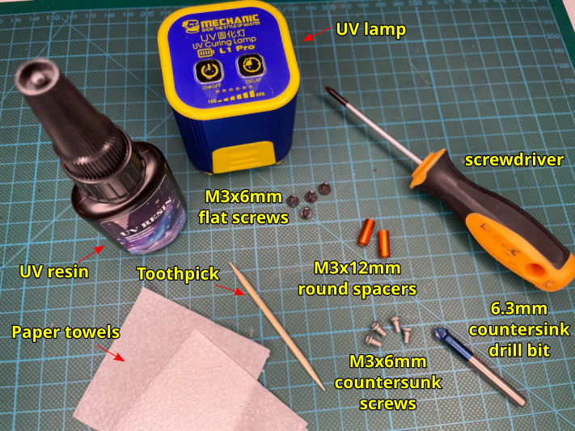](images/riskymsx-enclosure-required-items-and-tools-IMG_7775-annotated.png)

### Assembly instructions

#### Initial assembly without gluing ####

1. Use the provided [CAD design file](enclosure/riskymsx-enclosure-acrylic-2mm-dina5-ready-to-lasercut.dxf) to have the acrylic sheet cut by laser into the required parts.

[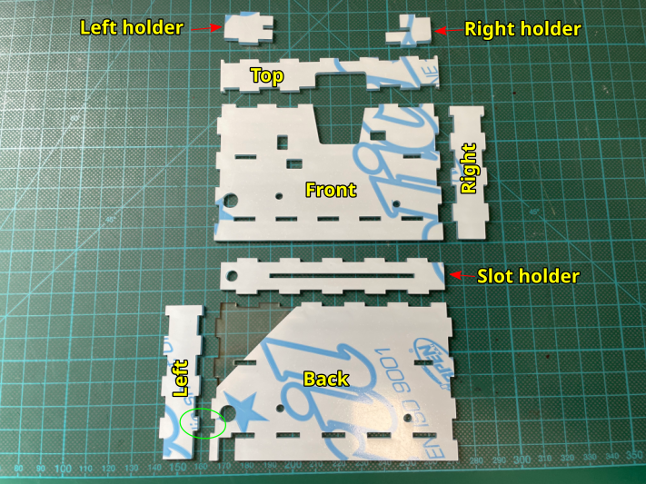](images/riskymsx-enclosure-parts-overview-IMG_7748-annotated.png)

2. Peel the plastic protections from all the acrylic parts.

3. Start by screwing the two M3 12mm spacers to the `Back` part using two M3 6mm flat screws.

[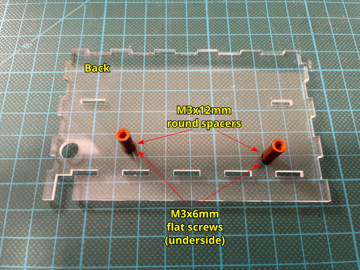](images/riskymsx-enclosure-assembly-step-10-IMG_7749-annotated.png)

4. Slide the RISKYMSX cartridge into the `Slot holder` part, then insert half way the RISKYMSX cartridge into the M3 spacers while at the same time aligning and inserting the `Slot holder` part into the `Back` part. Finally, slide in the `Left holder` and `Right holder` into the RISKYMSX cartridge and then insert them into the `Back` part.

[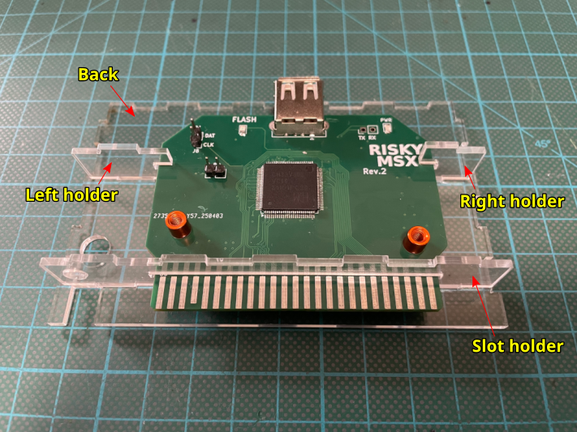](images/riskymsx-enclosure-assembly-step-20-IMG_7750-annotated.png)

5. Insert the `Left`, `Right` and `Top` parts into the `Back` part.

Make sure you don't mistakenly swap the `Left` and `Right` parts. The `Left` part has a smaller tab that goes into the `Back` part.

[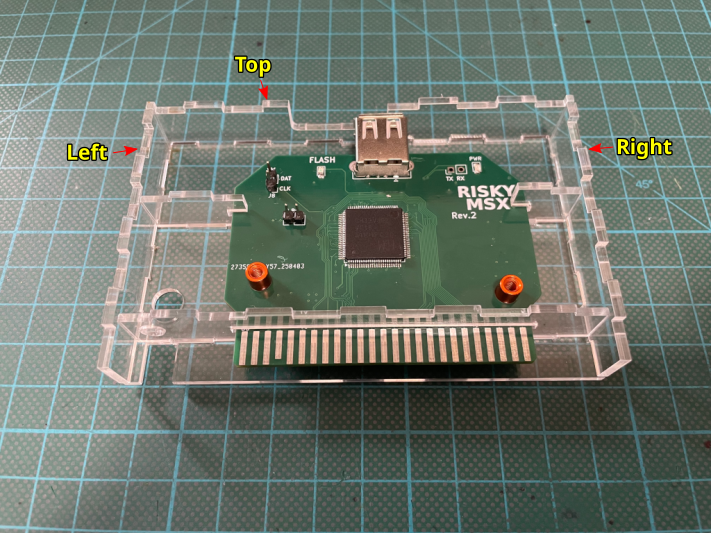](images/riskymsx-enclosure-assembly-step-30-IMG_7751-annotated.png)

6. Align and snap the `Front` part into the other parts. Then screw the two remaining M3 6mm flat screws, without tighten them too much.

[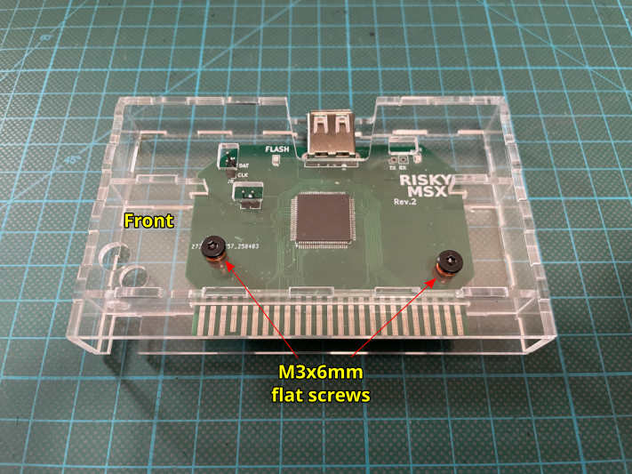](images/riskymsx-enclosure-assembly-step-40-IMG_7752-annotated.png)

#### Gluing the parts together ####

Now the enclosure is temporarily assembled and each part should be correctly aligned.

It's time to glue some of the parts using UV resin to make the enclosure strong and at the same time allow disassembling and re-assembling it at will.

* The `Front`, `Slot holder`, `Left holder` and `Right holder` parts _must NOT_ be glued, they must remain free in order to be able to assemble and disassemble the enclosure for maintenance.
* The `Back`, `Left`, `Right` and `Top` parts must be joined together using UV Resin and the UV curing lamp.
* You need to **make sure that you only use UV resin on the required bonding points** without touching any of the parts that need to remain free.
* Use the UV curing lamp to strengthen the bonds, they will harden under ultraviolet light in a few seconds.

1. Start with the `Right` part.

   * Reorient the cartridge in a _portrait_ position so that the `Right` part is at the top.
   * Remove just the `Right` part and put it aside.
   * Using a toothpick put small droplets of UV resin into the tab holes of the `Back` part that snap into the `Right` part.

  DO NOT put UV resin out of the green circled areas in the following picture.

[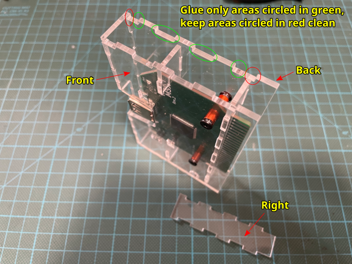](images/riskymsx-enclosure-assembly-step-50-IMG_7754-annotated.png)

   * Put back the `Right` part to its original position making sure it fits properly with the rest of the enclosure.
   * Remove, if any, the excess UV resin using a paper towel.
   * Secure the enclosure parts using some small clamps.
   * Apply UV light using the UV lamp to the `Back` to `Right` junctions to make the bonding strong.

The bonds will get super strong in just a few seconds under UV light.

[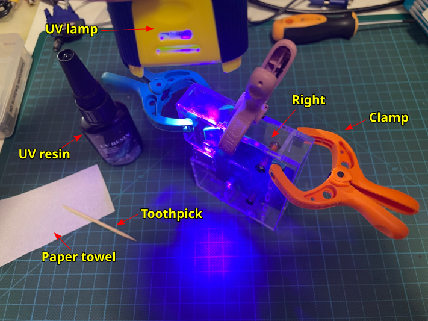](images/riskymsx-enclosure-assembly-step-60-IMG_7755-annotated.png)

2. Follow with the `Left` part.

   * Reorient the cartridge in a _portrait_ position so that the `Left` part is at the top.
   * Remove the `Left` part and put it aside.
   * Using a toothpick put small droplets of UV resin into the tab holes of the `Back` part that snap into the `Left` part.
   * Put back the `Left` part to its original position making sure it fits properly with the rest of the enclosure.
   * Remove any excess UV resin using a paper towel.
   * Secure the enclosure parts using some small clamps.
   * Apply UV light using the UV lamp to the `Back` to `Left` junctions to make the bonding strong.

[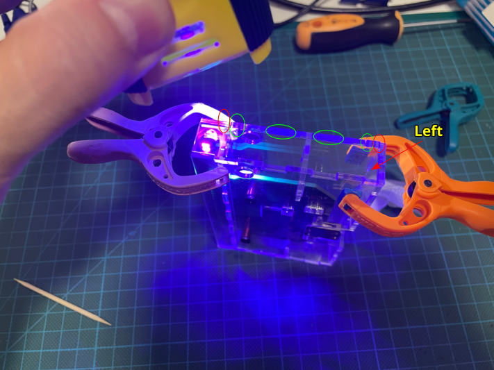](images/riskymsx-enclosure-assembly-step-70-IMG_7756-annotated.png)

3. Finish with the `Top` part.

   * Reorient the cartridge in a _landscape_ position so that the `Top` part is at the top.
   * Remove the `Top` part and put it aside.
   * Using a toothpick put small droplets of UV resin into the tab holes of the `Back` part that snap into the `Top` part.
   * Put back the `Top` part to its original position making sure it fits properly with the rest of the enclosure.
   * Remove any excess UV resin using a paper towel.
   * Secure the enclosure parts using some small clamps.
   * Apply UV light using the UV lamp to the `Back` to `Top` junctions to make the bonding strong.

[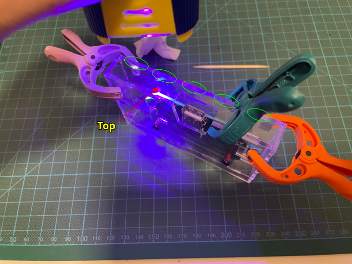](images/riskymsx-enclosure-assembly-step-80-IMG_7758-annotated.png)

#### Adding countersunk screws ####

Using countersunk screws avoids problems with the enclosure touching the slots contour, as the countersunk screws do not protrude as the flat screws do.

If you plan to use countersunk screws, you will need to use a 6.3mm countersink drill bit to prepare the screw holes for countersunk screws.
The countersunk part of the holes must face the exterior side of the enclosure.

[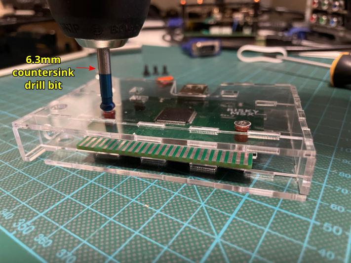](images/riskymsx-enclosure-assembly-step-90-IMG_7770-annotated.png)

[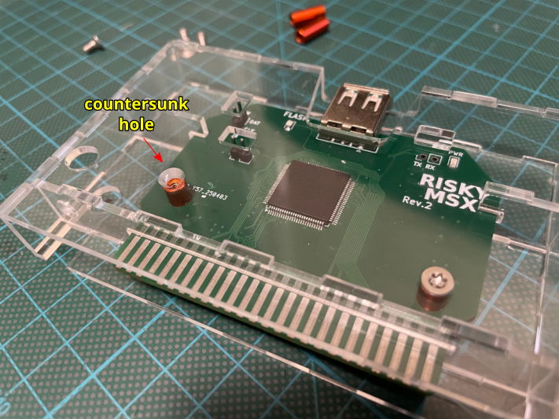](images/riskymsx-enclosure-assembly-step-95-IMG_7771-annotated.png)

## References

Arkadiusz Makarenko RISKYMSX
* https://github.com/arkadiuszmakarenko/RISKYMSX

Capsule5000 acrylic enclosures
* https://github.com/capsule5000?tab=repositories

